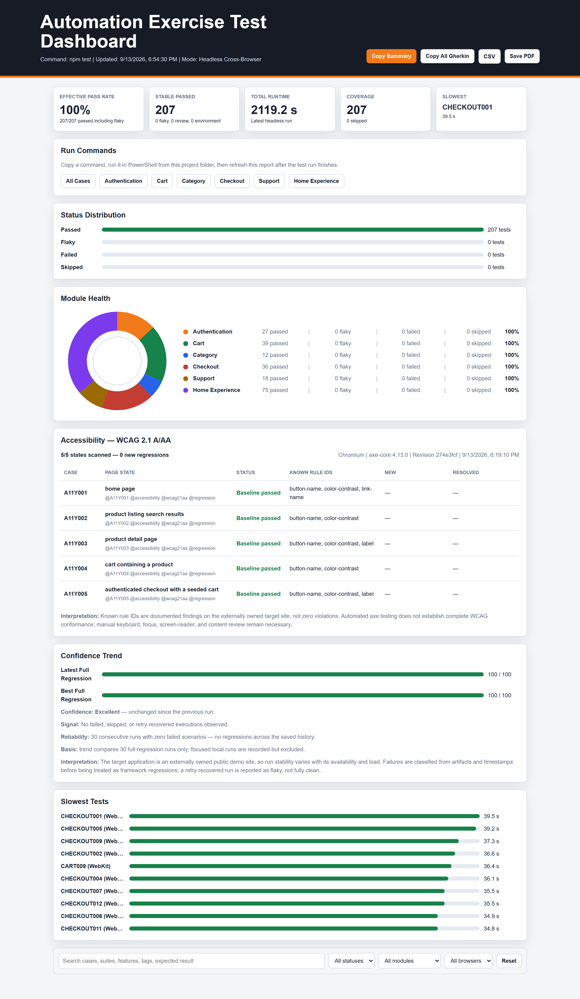

# Automation Exercise Playwright Portfolio

[](https://github.com/TugceAcir/automationexercise-playwright-portfolio/actions/workflows/playwright.yml)

This repository is a production-style UI test automation portfolio for [Automation Exercise](https://automationexercise.com/). It uses Playwright, TypeScript, page objects, generated test data, CI execution, technical reports, and a custom business dashboard that refreshes after every test run.

Maintained by [Tugce Acir](https://github.com/TugceAcir).

## Why This Project Stands Out

- The suite runs with conservative worker defaults because the target is a public demo site where aggressive parallelism can create noisy failures.
- Page objects keep selectors and UI mechanics out of business scenarios, while shared helpers handle repeated cross-page flows.
- Generated users avoid shared credentials and make account, cart, and checkout flows safe to rerun.
- The strategy keeps meaningful UI failures visible instead of bypassing them with direct route fallbacks.
- Playwright traces, screenshots, videos, a triage summary, and HTML reports support technical debugging.
- A custom business report translates raw automation results into release confidence, feature risk, and scenario evidence.
- Documentation explains how AI was used as an accelerator while human review owns the risk judgment and final evidence.

## Tech Stack

- Playwright Test
- TypeScript
- ESLint
- GitHub Actions
- GitHub Pages
- Custom HTML business reporter

## Getting Started

```bash
npm install
npx playwright install chromium firefox webkit
npm test
```

Optional environment configuration:

```bash
BASE_URL=https://automationexercise.com
WORKERS=1
```

`fullyParallel` is enabled in Playwright, but the configured worker count is intentionally conservative: local runs default to 1 worker and CI defaults to 2 workers unless `WORKERS` is set. This keeps the public demo site from creating noisy failures while still allowing controlled parallel execution.

The default test command runs the full UI E2E suite in headless Chromium, Firefox, and WebKit. Regenerate the portfolio dashboard afterward with `npm run business-report`, which refreshes:

```text
business-report/index.html
```

## Useful Commands

```bash
npm test                 # Run all tests headlessly
npm run test:chromium    # Run all tests in Chromium only
npm run test:firefox     # Run all tests in Firefox only
npm run test:webkit      # Run all tests in WebKit only
npm run test:smoke       # Run smoke tests only
npm run test:cross-platform # Run the focused smoke and session compatibility set
npm run test:regression  # Run regression tests only
npm run test:headed      # Debug in headed browser mode
npm run test:ui          # Use Playwright UI mode
npm run report           # Open Playwright technical HTML report
npm run business-report  # Regenerate the business dashboard from latest JSON results
npm run coverage:counts  # Regenerate README and AGENTS scenario counts
npm run coverage:check   # Verify generated scenario counts are current
npm run test:unit        # Unit-test the report tooling (scoring, Gherkin, enrichment)
npm run typecheck        # Validate TypeScript
npm run lint             # Validate code style
```

## Coverage

<!-- coverage:start -->
Last generated UI E2E suite snapshot: 70 scenarios. Cross-browser execution runs those scenarios across 3 browser projects for 210 browser-scenario executions.

| Business Area | Tests |
| --- | ---: |
| Authentication | 9 |
| Cart | 13 |
| Categories | 4 |
| Checkout | 12 |
| Support | 7 |
| Home Experience | 10 |
| Navigation | 3 |
| Product Discovery | 12 |
<!-- coverage:end -->

The suite intentionally keeps one strong version of each behavior. Low-value duplicates, such as repeated tab-close checks on stateless public pages, are removed so the suite stays easier to explain and maintain.

## Reviewer Path

If you have five minutes to review this portfolio, start with the GitHub Actions badge and latest workflow run, then open the live business dashboard. For implementation quality, read the test strategy, the environment-resilience ADR, and one page object such as `pages/CartPage.ts`. For failure handling, inspect `npm run triage:failures` output or the failed-run GitHub summary.

## Reporting

After each run, Playwright creates two report layers:

- `playwright-report/`: technical report with traces and failure evidence.
- `business-report/index.html`: portfolio-facing dashboard for recruiters and QA leads.

The business report includes a portfolio risk indicator, feature coverage, browser coverage, failed scenario risk, duration, attempts, and a local trend from `business-report/history.json`.

The current risk indicator starts from pass rate, then subtracts 12 points per failed scenario and 4 points per skipped scenario. Treat it as a transparent triage signal for portfolio review, not as a release guarantee or a substitute for trace review.

## Business Dashboard Preview

The dashboard is published from successful `main` runs:

- [Open the business dashboard](https://tugceacir.github.io/automationexercise-playwright-portfolio/)



The screenshot is an illustrative preview. The generated `business-report/index.html` file and the GitHub Pages dashboard are the current source of truth after each run.

## CI/CD

GitHub Actions runs the full suite in headless Chromium, Firefox, and WebKit on Ubuntu for pushes and pull requests to `main`. A separate compatibility workflow runs the focused `@smoke` and `@session` set on Windows and macOS every Monday and on manual dispatch.

The pipeline validates:

- TypeScript compilation
- ESLint rules
- Playwright UI E2E tests across Chromium, Firefox, and WebKit

Every run uploads Playwright reports, the business report, and raw test results as workflow artifacts. Successful pushes to `main` also publish `business-report/` to GitHub Pages so the portfolio dashboard can be opened from the repository's Pages URL:

- Repository: [TugceAcir/automationexercise-playwright-portfolio](https://github.com/TugceAcir/automationexercise-playwright-portfolio)
- CI/CD workflow: [Playwright Portfolio Tests](https://github.com/TugceAcir/automationexercise-playwright-portfolio/actions/workflows/playwright.yml)
- Business dashboard: [GitHub Pages report](https://tugceacir.github.io/automationexercise-playwright-portfolio/)

If GitHub Pages is not available for the private repository plan, the same business dashboard is still available as a downloadable workflow artifact.

## AI-Assisted Testing

See [docs/ai-testing-workflow.md](docs/ai-testing-workflow.md) for the workflow used to turn AI assistance into reviewed, maintainable automation instead of blind code generation.

## Extending And Debugging

- [Agent handoff](AGENTS.md) - architecture rules, suite map, current status, and next priorities
- [Test strategy](docs/test-strategy.md)
- [Environment resilience ADR](docs/adr/0001-environment-resilience-boundary.md)
- [AI-assisted testing workflow](docs/ai-testing-workflow.md)
- [Contributing workflow](CONTRIBUTING.md)
